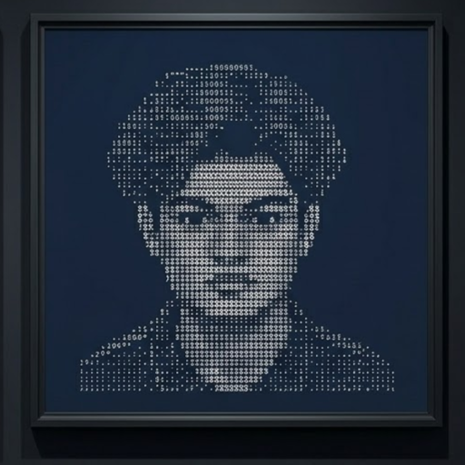

<!-- j4nya-BinSrcs/j4nya-BinSrcs · special profile repository -->

<table width="100%">
  <tr>
    <td align="center">
      
    </td>
    <td valign="middle">
      <pre>
<b>Janya Kansara</b>

📍  Location           Gujarat, India
🖥️  Environment        Arch Linux + Hyprland

🐍  LANGUAGES Python · Java · TS · Rust
🗄️  BACKEND   FastAPI · PostgreSQL · Valkey
🎨  FRONTEND  React · HTML/CSS
🔧  TOOLS     Git · Linux · Docker · Tantivy 

🧠  INTERESTS         Search &amp; IR · Backend · Tools · Graphics · Performance · Linux
      </pre>
    </td>
  </tr>
</table>

<table width="100%">
  <tr>
    <td align="center">
      
    </td>
    <td align="center">
      
    </td>
  </tr>
</table>

---

  
  &nbsp;
  
  &nbsp;
  

<!-- Portfolio URL not finalized — add here when available:
[Portfolio](https://your-domain.dev)
-->
