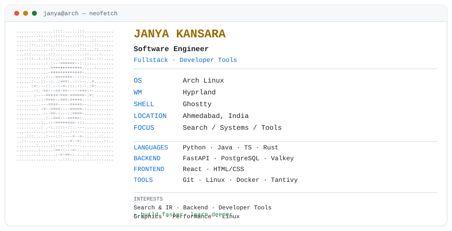
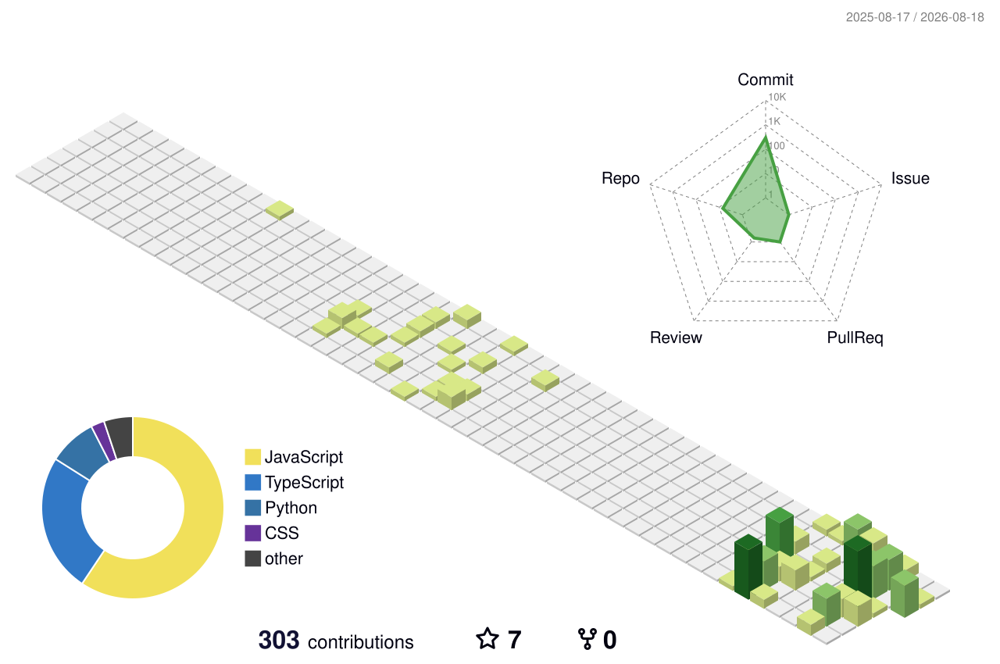

<!-- j4nya-BinSrcs/j4nya-BinSrcs · special profile repository -->

<picture>
  <source
    media="(prefers-color-scheme: dark)"
    srcset="./assets/neofetch-dark.svg"
  >
  <source
    media="(prefers-color-scheme: light)"
    srcset="./assets/neofetch-light.svg"
  >
  
</picture>

```text
> currently_building
```

### [Qwry](https://github.com/j4nya-BinSrcs/qwry) — Self-Hostable Search Engine

Privacy-focused and self-hostable. Qwry combines federated web search with a
custom indexing engine and an interactive research workspace, built for power
users who want their own search stack.

`38K+` indexed documents · `~70` search providers · `~230ms` average search latency

**Rust** · Tantivy · **FastAPI** · React · PostgreSQL · Valkey · SearXNG

```text
> engineering_interests
```

```
Search & Information Retrieval
Developer Tools
Backend Systems
Computer Graphics
Performance Engineering
Linux & Developer Environments
```

```text
> stack
```

| Languages                    | Backend & Data                          | Frontend           |
| ---------------------------- | --------------------------------------- | ------------------ |
| Python · Java · JavaScript   | FastAPI · Django · SQLAlchemy           | React · HTML · CSS |
| TypeScript · Rust · SQL      | PostgreSQL · SQLite · MySQL · MongoDB   | Tailwind CSS       |

```text
                           Systems & Tooling
```
Linux · Git · Docker · Tantivy · SearXNG · OpenCV

```text
> contribution_activity
```

<picture>
  <source
    media="(prefers-color-scheme: dark)"
    srcset="./profile-3d-contrib/profile-green-animate.svg"
  >
  <source
    media="(prefers-color-scheme: light)"
    srcset="./profile-3d-contrib/profile-green-animate.svg"
  >
  
</picture>

*Generated automatically from real contribution data via
`yoshi389111/github-profile-3d-contrib`.*

```text
> currently_learning
```

Rust · Search Indexing · Agentic Systems · Rendering Pipelines · Performance Engineering

---

```text
> connect
```

[GitHub](https://github.com/j4nya-BinSrcs) · [LinkedIn](https://www.linkedin.com/in/janya-kansara-6b718a3a0/) · [kansarajanya@gmail.com](mailto:kansarajanya@gmail.com)

<!-- Portfolio URL not finalized — add here when available:
[Portfolio](https://your-domain.dev)
-->
