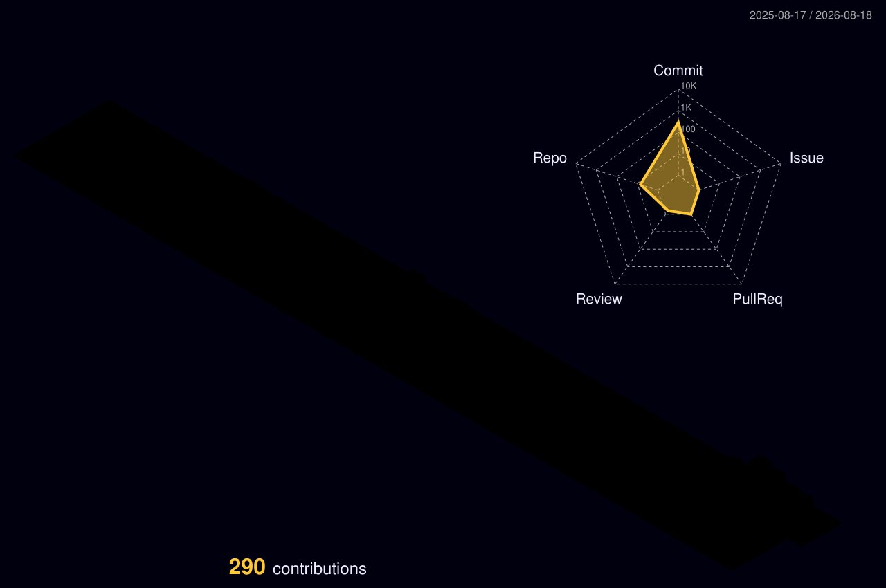

<!-- j4nya-BinSrcs/j4nya-BinSrcs · special profile repository -->

<table>
  <tr>
    <td align="center">
      
    </td>
    <td valign="middle">
      <pre>
<b>JANYA KANSARA</b>
Software Engineer · Fullstack · Developer Tools

🖥️  OS        Arch Linux
🪟  WM        Hyprland
🐚  SHELL     Ghostty
📍  LOCATION  Ahmedabad, India
🎯  FOCUS     Search / Systems / Tools

🐍  LANGUAGES Python · Java · TS · Rust
🗄️  BACKEND   FastAPI · PostgreSQL · Valkey
🎨  FRONTEND  React · HTML/CSS
🔧  TOOLS     Git · Linux · Docker · Tantivy

🧠  INTERESTS Search &amp; IR · Backend · Tools
             Graphics · Performance · Linux
      </pre>
    </td>
  </tr>
</table>

---

## 🧠 Engineering Interests

Search & Information Retrieval · Developer Tools · Backend Systems · Computer Graphics · Performance Engineering · Linux

---

## 🛠️ Stack

| Languages | Backend & Data | Frontend |
|---|---|---|
| Python · Java · JavaScript · TypeScript · Rust · SQL | FastAPI · Django · PostgreSQL · SQLite · MySQL · MongoDB · Valkey · SQLAlchemy | React · HTML · CSS · Tailwind CSS |

*Systems & Tooling:* Linux · Git · Docker · Tantivy · SearXNG · OpenCV

---

## 🌱 Currently Learning

Rust · Search Indexing · Agentic Systems · Rendering Pipelines · Performance Engineering

---

## 📈 Contribution Activity

  

*Generated automatically from real contribution data via `yoshi389111/github-profile-3d-contrib`.*

---

## 📬 Connect

  <a href="https://github.com/j4nya-BinSrcs">
    <picture>
      <source media="(prefers-color-scheme: dark)" srcset="https://cdn.simpleicons.org/github/ffffff">
      
    </picture>
  </a>
  &nbsp;
  
  &nbsp;
  

<!-- Portfolio URL not finalized — add here when available:
[Portfolio](https://your-domain.dev)
-->
